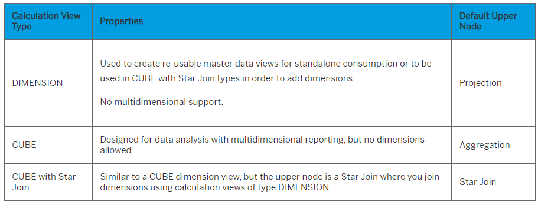

# HC300 - SAP Hana Cloud Modeling

## Concepts 
1. Measure: A numeric value that aritmitic can be preformed on.
2. Attribute: An elament used to describe a measure 
3. Dimension: Grouped attriburtes are called a dimension
4. Star Schema: A star schema is a database organizational structure optimized for use in a data warehouse or business intelligence that uses a single large fact table to store transactional or measured data, and one or more smaller dimensional tables that store attributes about the data.
5. Hierarchy: A hierarchical database model is a data model in which the data are organized into a tree-like structure
6. Semantics: used to describe a pice of data

## Calculation Views 
Calculation views are used in SAP HANA to create a Virtual Data Model (VDM), based on the data that resides in the SAP HANA database schemas. 

Calculation views are views that provide aggregations on the database level. Traditionally we would pass data to an application and preform data aggregation here. However this has an impact on the preformance as there is expensive I/O and then wcomes the manipulation. 

Hana provides a means to do all this calulations at the database level. Then the results are what is returned to the application.

Advantages: 
1. All calculations are performed on the fly within the database engines
2. Reusability
3. Flexibility
4. Adaptability
5. Easy to transport

Types: 

Nodes in a calculation view: 

### Nodes 
A Projection node is typically used in the following scenarios:

1. To filter measures based on attributes values.
2. To extract only some columns from a data source.
3. To define calculated columns, in particular when the calculation must occur BEFORE an aggregation.
Indeed, calculated columns in the Aggregation nodes of calculation views are always executed AFTER the aggregation.

### Join Nodes 

1. **Inner Join:** returns rows when there is at least one match on both sides of the join
2. **Left Outer Join:** returns all rows from the left table, even if there are no matches in the right table.
3. **Right Outer Join:** returns all the records from the right table even if there are no matches in the left table
4. **Full outer Join:** returns records from both data sets matching or otherwise. 
5. **Referential Join:** Referential integrity is the fact that matches exist between the joined tables (in one direction, for example left to right, or right to left, or both). If there is no match the join does not get executed 
6. **Text Join:** handles the translation of attribute labels in a way that corresponds to how translation texts are stored in the master data 
7. **Temporal Join:** join in order to find matching records from two tables based on a date. The records are matched only if a date column of one table is within a time interval defined by two columns of the other table.
8. **Star Join:** The Star Join in calculation views of the type CUBE with Star Join is a node type, rather than a join type

**Join Cardinality:** The cardinality of a join defines how the data from two tables joined together are related, in terms of matching rows.

### Union Node

A Union node is used to combine two or more data sets to a common set of columns

### Aggregation Node 
The purpose of an Aggregation node is to apply aggregate functions to measures based on one or several attributes.

*This function acts similarly to a GROUP BY clause in an SQL query, where you must specify the aggregate function for each measure. Here, the GROUP BY clause is not materialized as such, but takes each and every attribute selected for the output.*

### Star Join Node

Star joins connect a central data entity to multiple entities that are logically related. You can create a graphical calculation view with star joins that join multiple dimensions to a single fact table.

### Rank Node
Rank nodes help you partition the data source for a set of partition columns and then perform an order by SQL operation on the partitioned set.