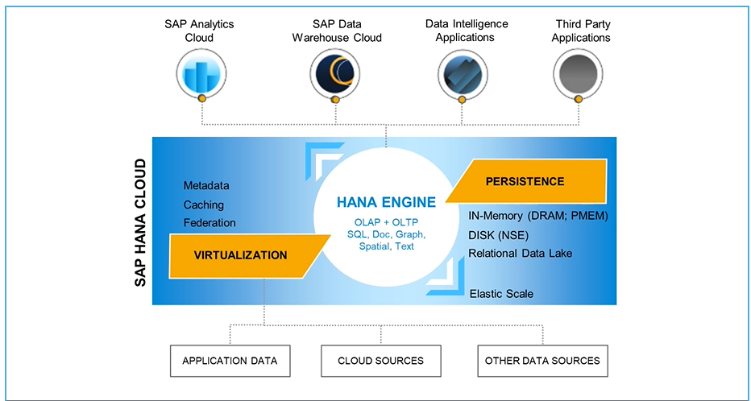
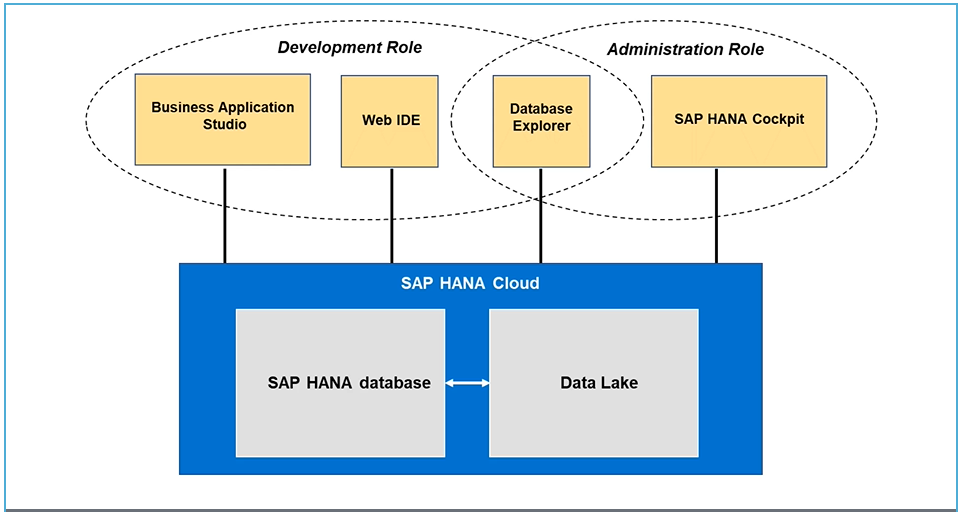
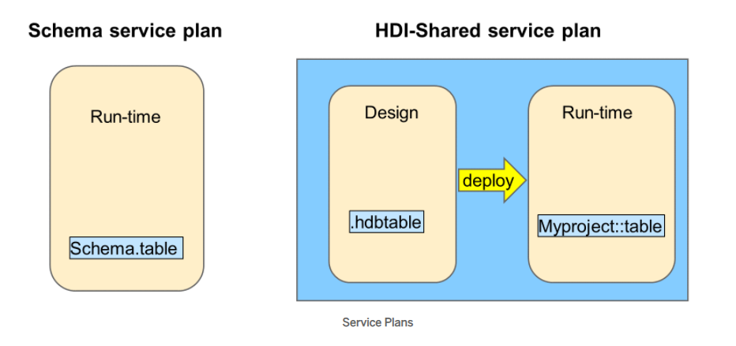

## SAP Hana Cloud:

SAP Hana cloud is a public cloud service offering of the SAP hana in memory data processing platform. 

 

## Hana Cloud Interfaces

Business Application Studio (BAS) - Used by developers to build and maintain applications. 

Web IDE - The original interface used by developers to build applications. 

Database Explorer - This is an interface that is used by developers and also administrators. The Database Explorer is used to explore the run-time objects of the database, for example, tables, views and stored procedures. It includes a built in SQL console where SQL statements can be executed against the database.

SAP HANA Cockpit - Used by administrators to monitor the platform

 

## Service Plans

**Schema service plan** — Create all database artifacts directly to schemas using SQL. This run-time only option is the approach that has been used for many years with traditional databases and appeals to organizations that only need a database to power their applications and do not require design-time tooling to define the database artifacts as source files. You will manually define schemas to manage your database run-time objects.

**HANA Deployment Infrastructure (HDI) Shared service plan** — Provides a combined database design-time and run-time environment. Database objects are deployed to containers that guarantee isolation. This plan provides tools for the full life-cycle development and deployment of database artifacts. With this plan you don't have to worry about schemas as these are invisible to the developer and managed by the HDI framework.

